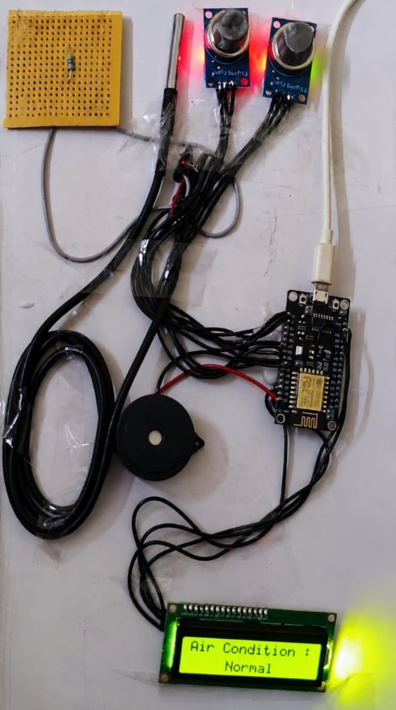
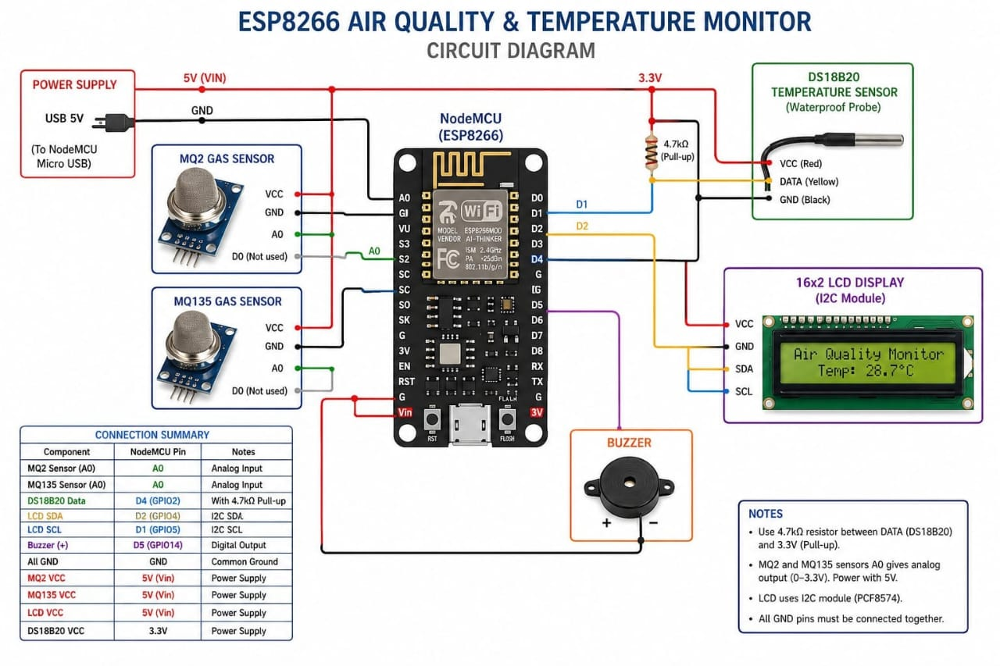

# Asthma Monitoring System

A real-time asthma monitoring system that detects harmful gases, monitors temperature, triggers an audible alert, and performs web-based data logging for continuous environmental monitoring.

## Overview

Asthma patients are highly sensitive to poor air quality and sudden environmental changes. This project continuously monitors air quality and temperature using gas and temperature sensors. When harmful gases are detected, the system activates a buzzer to provide an immediate warning while simultaneously logging sensor data to a web dashboard for monitoring and analysis.

## Features

- Real-time air quality monitoring
- Harmful gas detection using MQ2 and MQ135 sensors
- Temperature monitoring using the DS18B20 sensor
- Audible buzzer alert during unsafe conditions
- 16×2 LCD for live status display
- Web-based data logging for remote monitoring
- Developed using ESP8266 and Arduino IDE

## Hardware Components

- ESP8266 (NodeMCU)
- MQ2 Gas Sensor
- MQ135 Air Quality Sensor
- DS18B20 Temperature Sensor
- 16×2 LCD Display (I2C)
- Buzzer
- Jumper Wires
- USB Power Supply

## Software

- Arduino IDE
- C++
- ESP8266 Libraries

## Web Dashboard

Sensor readings are stored and monitored through the web dashboard:

https://esskay-012024.live/pollution12345/index.php

## Working Principle

The ESP8266 continuously reads data from the MQ2, MQ135, and DS18B20 sensors. When harmful gases or poor air quality are detected, the system activates a buzzer and displays a warning message on the LCD. Under normal conditions, the LCD displays the current temperature and air quality status. Every few seconds, the collected sensor readings are transmitted to the web dashboard for real-time monitoring and data logging.

## Project Gallery

### Prototype

### Circuit Diagram

## Author

**Pravanthika B S**  
Biomedical Engineering Student | Where medicine meets engineering
